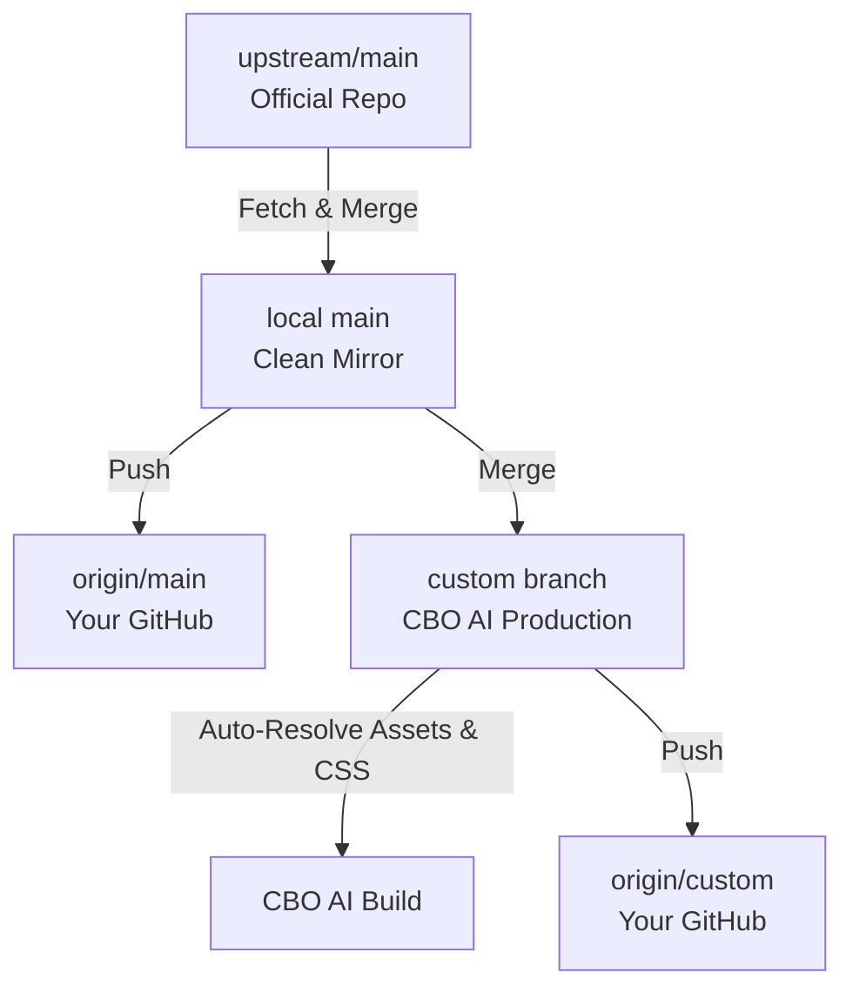

# CBO AI Customization & Maintenance Guide

## Overview
This repository is a customized fork of [Open WebUI](https://github.com/open-webui/open-webui) tailored for the **Central Bank of Oman (CBO)** under the title **CBO AI**.

This project is structured specifically to allow continuous updates from the upstream repository without recurring git merge conflicts.

---

## Brand Identity Assets & Roles

| Asset Path | Origin | Role |
| :--- | :--- | :--- |
| `static/cbo/cbo-seal.png` | Official Circular Seal | Master high-resolution CBO seal |
| `static/cbo/cbo-motif.png` | Diamond Emblem | CBO Diamond Motif for icons & splash |
| `static/cbo/cbo-building-hero.png` | Building Artwork | Authentication & Login backdrop artwork |
| `static/cbo/cbo-logo-horizontal.png` | Horizontal Bilingual Logo | Sign-in header logo |
| `static/cbo/cbo-logo-horizontal-rtl.png` | Horizontal Logo (RTL) | Arabic layout header logo |
| `static/favicon.png` | Derived from Seal | Root browser favicon (512x512) |
| `static/static/favicon.png` | Derived from Seal | Static favicon (512x512) |
| `static/static/favicon.ico` | Derived from Seal | Multi-size ICO (16x16, 32x32, 48x48) |
| `static/static/splash.png` | Derived from Diamond Motif | Loading splash screen |
| `static/static/splash-dark.png`| Derived from Diamond Motif | Dark mode loading splash screen |
| `static/static/logo.png` | Derived from Diamond Motif | App logo |
| `static/static/custom.css` | CBO Stylesheet | Zero-conflict CSS injection for theme & layout |

To regenerate all derived icons from the master assets at any time:
```powershell
python scripts/setup-cbo-branding.py
```

---

## How Future Upstream Updates Work



### 1-Click Automated Sync

Whenever Open WebUI releases a new version or bugfix, run the synchronization script:

**Windows PowerShell:**
```powershell
.\scripts\sync-upstream.ps1
```

**Linux / macOS / Bash:**
```bash
./scripts/sync-upstream.sh
```

### What the sync script does automatically:
1. Validates that your working directory is clean.
2. Fetches the latest commits from `upstream` (`open-webui/open-webui`).
3. Updates your local `main` branch with `--ff-only`.
4. Pushes the updated `main` to your GitHub fork (`origin/main`).
5. Merges `main` into your `custom` branch.
6. Auto-resolves any static branding conflicts in favor of CBO assets.
7. Verifies CBO brand assets and pushes the updated `custom` branch to `origin/custom`.

---

## Git Remote Topology

Check your remotes at any time:
```powershell
git remote -v
```

Expected configuration:
- `origin`: `https://github.com/abdulrahimzadjali/cbo-open-webui.git` (Your Fork)
- `upstream`: `https://github.com/open-webui/open-webui.git` (Official Repository)

---

## Environment Variables (`.env`)

A default `.env` file has been created with:
```env
WEBUI_NAME="CBO AI"
WEBUI_NAME_EXACT="true"
```
Because `.env` is gitignored, your operational configurations will never be overwritten or conflict when updating from upstream.
